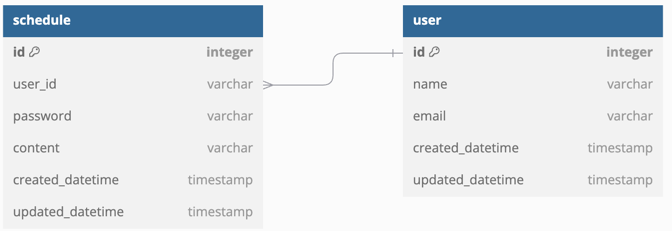

## 필수과제 API 명세

| 기능       | Http Method | Path            | query Param       | request Body                                                                               | response Body                                                                                                                                                                                 | 
|----------|-------------|-----------------|-------------------|--------------------------------------------------------------------------------------------|-----------------------------------------------------------------------------------------------------------------------------------------------------------------------------------------------|
| 일정 저장    | `POST`      | /schedules      | -                 | {  "author" : "String",   "password" : "String",   "content" : "String"  } | {   "id" : "Number",   "author" : "String",   "content" : "String",   "createdDatetime" : "DateTime",   "updatedDatetime" : "DateTime" }                              |
| 일정 목록 조회 | `GET`       | /schedules      | name, updatedDate | -                                                                                          | [  &nbsp;{   "id" : "Number",   "author" : "String",   "content" : "String",   "createdDatetime" : "DateTime",   "updatedDatetime" : "DateTime"  &nbsp; }   ] |
| 일정 단건 조회 | `GET`       | /schedules/{id} | -                 | -                                                                                          | {   "id" : "Number",   "author" : "String",   "content" : "String",   "createdDatetime" : "DateTime",   "updatedDatetime" : "DateTime" }                              |
| 일정 수정    | `PUT`       | /schedules/{id} | -                 | {  "password" : "String",   "content" : "String"  }                            | {   "id" : "Number",   "author" : "String",   "content" : "String",   "createdDatetime" : "DateTime",   "updatedDatetime" : "DateTime" }                              |
| 일정 삭제    | `DELETE`    | /schedules/{id} | password          | -                                                                                          |                                                                                                                                                                                               |

## 필수과제 ERD

## 도전과제 API 명세
| 기능       | Http Method | Path            | query Param                             | request Body                                                                               | response Body                                                                                                                                                                                                            | 
|----------|-------------|-----------------|-----------------------------------------|--------------------------------------------------------------------------------------------|--------------------------------------------------------------------------------------------------------------------------------------------------------------------------------------------------------------------------|
| 일정 저장    | `POST`      | /schedules      | -                                       | {  "userId" : "Number",   "password" : "String",   "content" : "String"  } | {   "id" : "Number",   "userId" : "Number",   "author" : "String",   "content" : "String",   "createdDatetime" : "DateTime",   "updatedDatetime" : "DateTime" }                              |
| 일정 목록 조회 | `GET`       | /schedules      | name, updatedDate, pageNumber, pageSize | -                                                                                          | [  &nbsp;{   "id" : "Number",   "userId" : "Number",   "author" : "String",   "content" : "String",   "createdDatetime" : "DateTime",   "updatedDatetime" : "DateTime"  &nbsp; }   ] |
| 일정 단건 조회 | `GET`       | /schedules/{id} | -                                       | -                                                                                          | {   "id" : "Number",   "userId" : "Number",   "author" : "String",   "content" : "String",   "createdDatetime" : "DateTime",   "updatedDatetime" : "DateTime" }                              |
| 일정 수정    | `PUT`       | /schedules/{id} | -                                       | {  "password" : "String",   "content" : "String"  }                            | {   "id" : "Number",   "userId" : "Number",   "author" : "String",   "content" : "String",   "createdDatetime" : "DateTime",   "updatedDatetime" : "DateTime" }                              |
| 일정 삭제    | `DELETE`    | /schedules/{id} | password                                | -                                                                                          |                                                                                                                                                                                                                          |

## 도전과제 ERD
